# Architecture

How the Hyderabad Corridor Ledger fits together, as built on 14 September
2026. Anything planned but not built is marked **NOT BUILT** or **NOT
DEPLOYED**. Right now:
- the database holds zero real samples;
- every corridor is a draft placeholder;
- nothing is deployed.

Every diagram is Mermaid, rendered by GitHub. Each is followed by what it
shows and what it leaves out. The working rules behind all of this are in
[CLAUDE.md](../CLAUDE.md), and the audit's statistics in
[methodology.md](methodology.md).

1. [System architecture](#1-system-architecture)
2. [Sample lifecycle](#2-sample-lifecycle)
3. [Data model](#3-data-model)
4. [Corridor lifecycle](#4-corridor-lifecycle)
5. [Treatment classification](#5-treatment-classification)
6. [Metric pipeline](#6-metric-pipeline)
7. [Audit inference](#7-audit-inference)
8. [Trust chain](#8-trust-chain)
9. [Schedule and budget](#9-schedule-and-budget)
10. [Build phases](#10-build-phases)
11. [Decisions and the evidence behind them](#11-decisions-and-the-evidence-behind-them)

## 1. System architecture

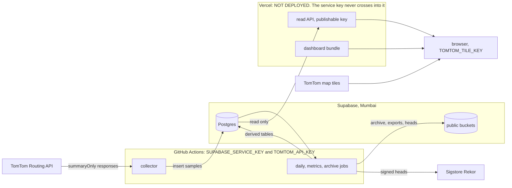

**Who holds what.**
- **GitHub Actions.** The collector is the only process that calls the Routing
  API. It and the nightly jobs are the only processes holding the Supabase
  service key and the server-side TomTom key, and both run only in GitHub
  Actions.
- **Supabase** holds the Postgres ledger and derived tables, and three public
  buckets: the monthly Parquet archive, the exports, and the signed chain
  heads.
- **Vercel.** Everything to the right of Supabase is meant for Vercel. The
  read API gets only the publishable key, and refuses to start if it finds the
  service key in its environment. The dashboard bundle holds no key but the
  browser tile key. Neither is deployed: no Vercel project exists,
  `VERCEL_TOKEN` is absent, and the tile key has not been created.

**Tiles.** Browsers pull map tiles straight from TomTom. Nothing in this
system proxies or meters them, and TomTom's Terms do not allow a proxy that
caches tiles for many users.

**Not shown:** the test, authorship and guard workflows, and a reader
verifying a Rekor entry.

## 2. Sample lifecycle

This is the most important diagram in the document: every number the project
publishes starts here.

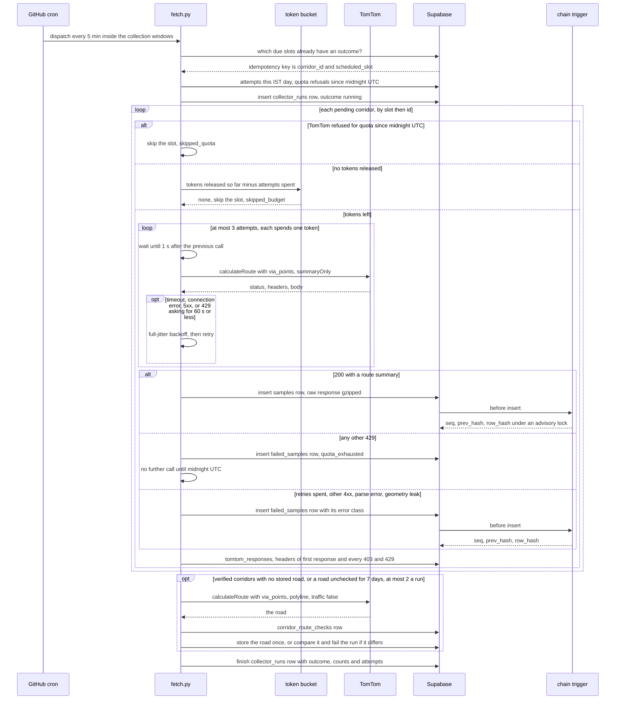

**Dispatch and idempotency.**
- **Dispatch.** GitHub Actions starts `fetch.py` every five minutes inside the
  collection windows. Each run measures the latest slot of every active
  corridor that came due less than one slot spacing ago.
- **No duplicates.** The idempotency key is (corridor_id, scheduled_slot). It
  is unique in `samples` and in `failed_samples`, and a trigger allows one
  outcome per slot across the two. A late or repeated run therefore never
  makes a second row.
- **No backfill.** A slot no run reaches in time is never collected late. It
  becomes a gap, and the daily alarm counts it.

**Spending the budget.**
- **The bucket.** It releases tokens as the day's slots come due, holding 15%
  back for retries. Every HTTP attempt spends one token, retries included.
- **Spacing.** Attempts are held at least a second apart. Only one collector
  run can execute at a time, so this caps the whole project at one request a
  second, under TomTom's default Routing limit of 5 QPS.

**Every outcome is recorded.** Each slot ends as exactly one row: a sample, or
a failure with its error class. A failure is never dropped. Both tables are
hash-chained by a database trigger, which computes each row's hash under an
advisory lock, so concurrent writers cannot fork a chain.

**Rate-limit refusals.** TomTom documents 429 for both a rate-limit refusal
and an exhausted allowance, and nothing that tells them apart.
- A 429 asking for a wait of a minute or less is retried.
- Any other 429 is treated as quota. The run stops, the run itself fails, and
  no further call is made until midnight UTC.

**Corridor roads.** After the slots, a run checks the roads of verified
corridors: at most two a run, one attempt each, from the same budget.
- A corridor with no stored road gets one polyline call, stored permanently.
- A stored road is refetched weekly and compared. One that differs fails the
  run, and is never written over the stored road.

**Not live yet.** Keeping TomTom's response headers (`tomtom_responses`) and
the `quota_exhausted` run outcome need migration 0011. Corridor roads need
0012. Both are written and not applied.

## 3. Data model

The schema is split into three diagrams so each stays readable. There is no
budget table: each run computes the budget from the attempts recorded in
`samples`, `failed_samples` and `collector_runs`, taking for each run the
larger of its run row and its outcome rows.

### 3a. The ledger and the collector

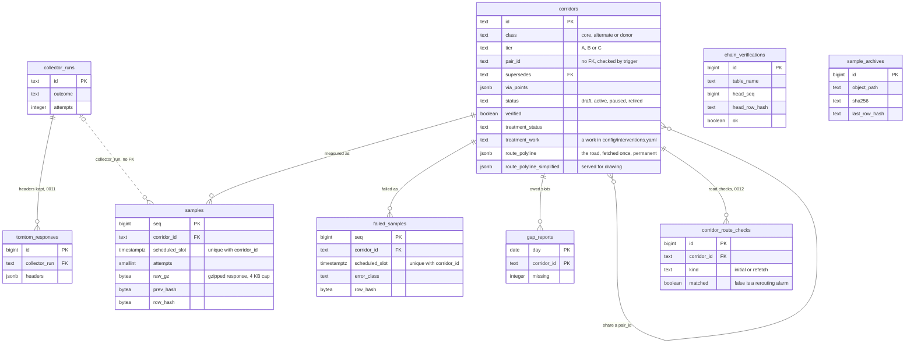

`corridors` is the one table everything else points at.
- **Pairs.** A pair is not a foreign key. A core corridor and at most one
  alternate per direction share a `pair_id`, and `collector/config.py` and the
  `corridors_check_pair` trigger check that they share endpoints and differ in
  `via_points`.
- **Superseding.** `supersedes` is a real foreign key: a corridor whose road
  changes is retired, and its successor names it.
- **The chained tables.** `samples` and `failed_samples` are the hash-chained
  ledger. UPDATE and TRUNCATE always raise. DELETE is allowed only inside
  `prune_archived()`, after `sample_archives` records a Parquet file that was
  downloaded again and re-verified.
- **Chain walks.** `chain_verifications` records each walk of both chains,
  with its head hash and first break.
- **Roads.** `route_polyline` is the corridor's road, fetched once at
  verification and frozen by `corridors_guard` together with the points it was
  routed through. `corridor_route_checks` records every road call, and the
  service role can neither update nor delete it: it is the evidence for a
  rerouting alarm.
- **Pending.** `tomtom_responses` (0011), the road columns and
  `corridor_route_checks` (0012) exist only in migrations not yet applied.

### 3b. Derived tables and the read model

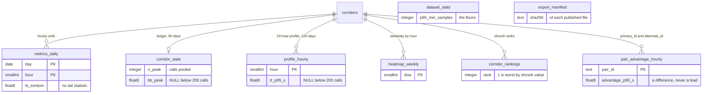

**What is disposable.** Every table here is derived and disposable.
`python -m metrics backfill` rebuilds all of them from the archive plus the
live tables, and refuses to run if any seq is missing. Nobody edits a derived
row by hand; a definition change bumps `METHOD_VERSION` and triggers a
rebuild.

**Tail statistics.**
- Only the pooled tables hold tail statistics (p95, BTI, PTI):
  `corridor_stats`, `profile_hourly`, `pair_advantage_hourly` and
  `intervention_audit`.
- Each is NULL below its floor, with the pooled count beside it.

**Other tables.** Also derived, and not drawn: `metrics_day`,
`network_hourly`, `worst15_daily`, `stl_daily`, `change_points`,
`recovery_events`, `recovery_km`, `recovery_cox` and `before_after`.

### 3c. Interventions, the audit and the registers

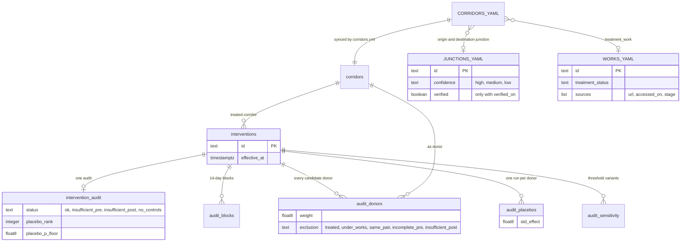

The upper-case entities are YAML files, validated in CI and not database
tables.
- **`CORRIDORS_YAML`** is `config/corridors.yaml`, the only place a corridor
  is declared. `corridors.yml` syncs it into `corridors` on every push to
  `main`.
- **`JUNCTIONS_YAML`** is `config/junctions.yaml`: junction candidates, not
  values. A corridor naming a junction must sit exactly on it, and cannot be
  verified while the junction is not.
- **`WORKS_YAML`** is the works register in `config/interventions.yaml`.

**The `interventions` table** holds the effective dates audits are computed
around. It is not the works register, and it is empty. **The audit tables**
publish everything behind a verdict, including every excluded donor and its
reason.

## 4. Corridor lifecycle

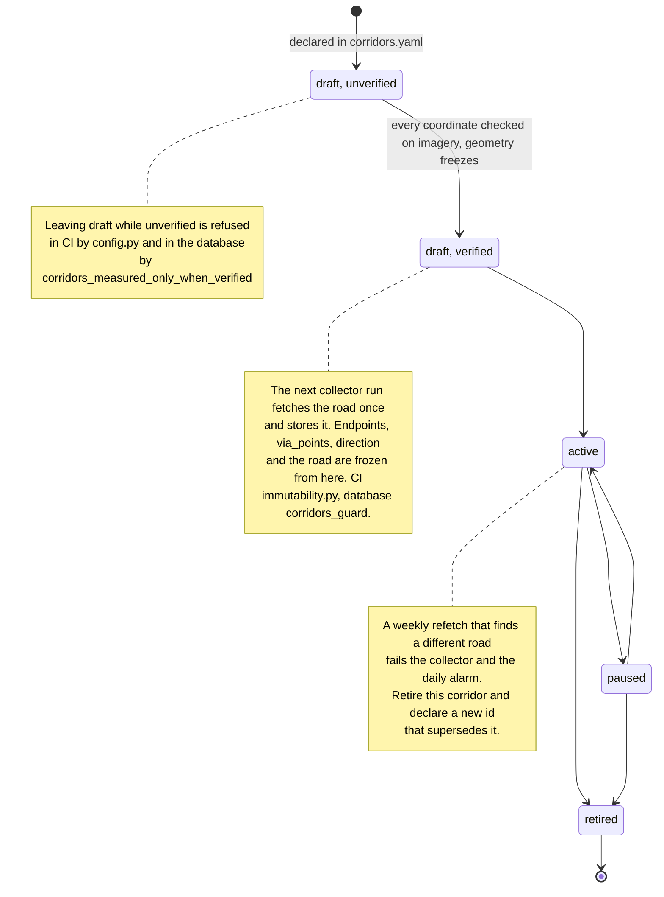

**Verification.**
- A corridor starts as a draft. It may leave draft only once a person has
  checked every coordinate on satellite imagery and set `verified`.
- An unverified corridor that tries to become active or paused is refused
  twice: by `collector/config.py` in CI, and by the
  `corridors_measured_only_when_verified` constraint (0010).
- The reason: public sources give neighbourhood centroids and metro stations,
  not junction centres, and a coordinate becomes permanent once measured.

**Freezing.**
- Geometry freezes at verification, before the first sample, because the
  collector then fetches the corridor's road, which is permanent with the points
  it was routed through. `collector/immutability.py` freezes it in CI from the
  first commit that marks the corridor verified. The `corridors_guard` trigger
  freezes it in the database from the moment a road is stored, or the corridor
  is first active.
- Superseding is how a road changes: the old corridor is retired, and a new
  id that names it starts again as a draft.

**Other checks, not drawn.**
- A pair's shared endpoints, enforced in CI and by a trigger.
- A donor must be untreated, enforced in CI and by a constraint.

## 5. Treatment classification

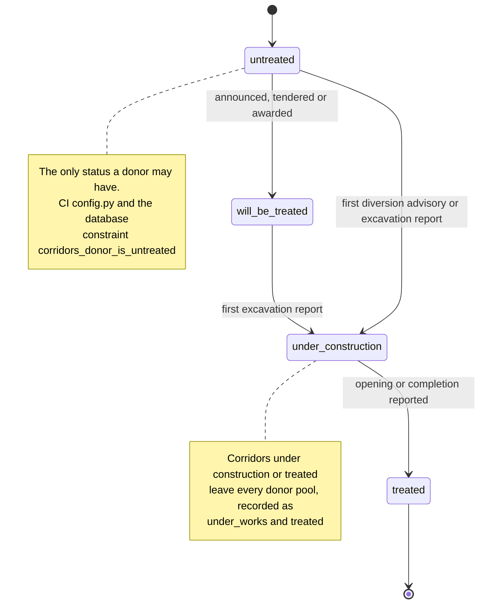

**What a status must cite.** Any status but untreated must cite a work in
`config/interventions.yaml` with the same status, and a source (URL and access
date) whose reported stage supports it:

| Status | Stages that support it |
|---|---|
| will_be_treated | proposed, planned, tendered, awarded |
| under_construction | under construction |
| treated | completed |

A link that reports a work only at an earlier stage keeps it uncitable, and a
work with no URL keeps an empty source list rather than borrowing an unrelated
link. `collector/registry.py` enforces this in CI.

**Two paths into construction.**
- **Controls.** A control moves to under_construction on the first
  traffic-diversion advisory or excavation report for its junction.
- **Announced works.** A will_be_treated work moves on its first excavation
  report.

**Weekly recheck.** `recheck.yml` fails once any work not yet treated, or a
screened control, is more than 92 days past its last check.

**Why construction ends a corridor's use as a control.** Traffic diverted
around works changes the donors themselves, so from under_construction on, a
corridor is excluded from every audit's donor pool.

## 6. Metric pipeline

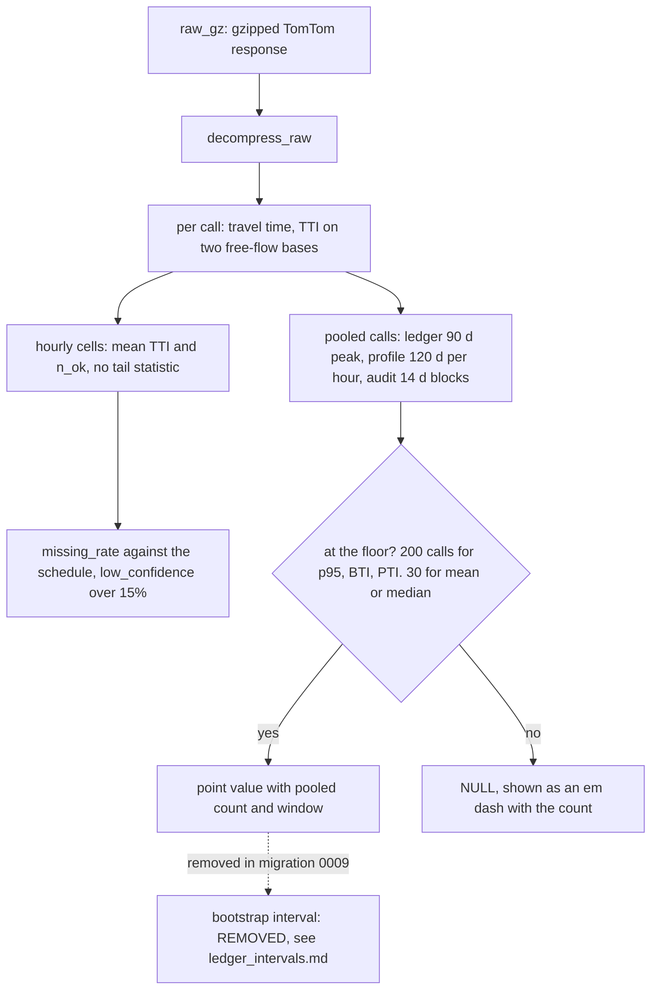

**Raw is the source of truth.**
- Each gzipped response is decompressed, and every call gets its travel time
  and TTI against both free-flow references: TomTom's no-traffic time, and the
  observed night p5.
- Only `metrics/io.py` reads or writes. Every other step is a pure function,
  so anyone holding the archive can reproduce a published number.

**Two branches from each call.**
- **Hourly cells** carry TTI and mean travel time with their counts. A cell
  holds two to four calls, so no tail statistic is ever computed on one.
- **Pooled distributions** gather calls over a stated window: every peak-hour
  call over 90 days for the ledger, each hour over 120 days for the profile
  and pair comparison, and 14-day blocks for the audit. BTI, PTI and every
  p95 are computed once on these.

**The floor.** Below 200 pooled calls, a value derived from a p95 is NULL and
renders as an em dash with its count. Means and medians need 30.

**No imputation.** Missing cells stay missing and carry their missing rate.
Nothing is interpolated.

**Where the intervals were.** A percentile bootstrap interval used to sit
beside each pooled value. It was removed from the ledger, the profile and the
pair comparison, and migration 0009 dropped the columns: it lost coverage in
simulation, and nothing observable could say when
([ledger_intervals.md](ledger_intervals.md)).

## 7. Audit inference

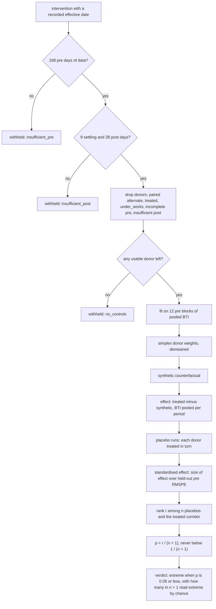

**Periods.** An audit is withheld until its corridor has 168 pre days (twelve
14-day blocks), 9 settling days and 28 post days. The status says which one
is missing.

**Donor exclusions.** From the other corridors the audit drops, recording the
reason for each:
- the treated corridor's own pair, because traffic diverting onto a paired
  alternate is a consequence of the intervention;
- every treated corridor;
- every corridor under construction or treated in the works register;
- every corridor whose pre blocks do not all reach the 200-call floor;
- every corridor with too little post data.

Missingness is not random: congested corridors fail the completeness test
more often. So the excluded corridors' missing rate and BTI are published
beside the donors'.

**The estimate.**
- **Weights** are fitted on the demeaned block BTIs, and are non-negative and
  sum to one.
- **The effect** compares BTI pooled once over the whole pre and post periods.

**The inference.**
- **Placebo runs.** The procedure is repeated with each donor as the treated
  corridor.
- **The ranked statistic** is the standardised effect: the size of the effect
  divided by the corridor's own leave-one-block-out pre RMSPE.
- **p and its floor.** p is the treated corridor's rank r over n + 1, and can
  never fall below 1 / (n + 1). With fewer than 19 placebos no effect can
  reach 0.05, and the verdict says so rather than being withheld.

**Published with every verdict:**
- p, with its rank and the placebo count;
- how many audits in n + 1 would read extreme by chance;
- an equal-weight cross-check;
- reruns at stricter and looser completeness thresholds.

There is no interval and no sequential test. The audit reports once, after
the post period closes.

## 8. Trust chain

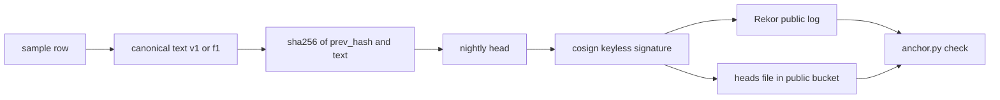

**The hash.**
- Each row of `samples` and `failed_samples` is serialised into a canonical
  text. Fields are joined by `|`, NULL is empty, timestamps are UTC with
  microseconds, and hashes are lowercase hex. Formats v1 and f1 are defined in
  the database and ported in `collector/chain.py`.
- Its `row_hash` is SHA-256 over the previous row's hash followed by that
  text, starting from 32 zero bytes. Changing any row breaks every hash after
  it.

**The nightly anchor.**
- Each night `daily.yml` walks both chains and records their heads.
- It signs the heads with keyless cosign: GitHub's OIDC token names
  `daily.yml` on `main`, and the signature is entered in Rekor, a public
  append-only log.
- The heads file and its signature bundle go to the public `archive` bucket.
- `anchor.py check` verifies every bundle's signer, then walks both chains from
  seq 1, archive files first and live tables after. It requires every anchored
  head to be exactly where it was.

**What it does not prove.**
- It proves what CI published and when, not that a measurement was right when
  TomTom returned it.
- Rows rewritten before the first anchored head are invisible to it. The only
  anchor so far, from 13 September 2026, covers two empty chains.
- Deleting anchor files from the bucket hides those anchors from the check,
  though their Rekor entries remain.
- Format v1 does not cover `samples.scheduled_slot` or `samples.attempts`,
  which were added later. The append-only guard protects them; the hash does
  not.
- The walk reads the live tables with the publishable key, which is not yet
  published anywhere. Until it is, outside readers can check signatures and
  the archive but not the live tables.

## 9. Schedule and budget

```mermaid
gantt
    title One IST day: collection windows and nightly jobs
    dateFormat HH:mm
    axisFormat %H:%M
    todayMarker off
    section Collection
    Night slots every 30 min for all tiers :night, 00:00, 4h
    Morning peak Tier A every 15 min and B or C every 30 min :morning, 06:30, 4h
    Evening peak Tier A every 15 min and B or C every 30 min :evening, 16:30, 270m
    section Nightly jobs
    daily chain walk and anchor and gap and usage alarm :milestone, daily, 02:47, 0m
    metrics backfill and exports :milestone, metrics, 03:11, 0m
```

**Windows.** Windows are half-open and in IST.
- **Night slots** (00:00–04:00) measure every tier every 30 minutes, for the
  observed free-flow reference.
- **Peaks.** In the morning (06:30–10:30) and evening (16:30–21:00) peaks,
  Tier A is measured every 15 minutes and Tiers B and C every 30.

**Nightly jobs.** They run after the IST day's last slot has closed. The
daily job walks and anchors the chains, then runs the gap and usage alarm. The
metrics job rebuilds every derived table.

| Tier | Night | Morning | Evening | Calls a day per corridor |
|---|---|---|---|---|
| A | 8 | 16 | 18 | 42 |
| B, C | 8 | 8 | 9 | 25 |

| Budget | Figure | Source |
|---|---|---|
| Collector ceiling | 2,400 attempts per IST day | `collector/budget.py` |
| Retry reserve | 15%, leaving 2,040 first attempts | `collector/budget.py` |
| Corridors the free allowance fits | no 15- or 20-minute panel of four treated corridors reaches 19 donors | [free_tier.md](free_tier.md), calls per 31-day month with retries and road checks |
| Spacing | at least 1 s between attempts | `collector/fetch.py` |
| TomTom's published free Routing allowance | 20,000 calls a month, reset time undocumented | TomTom pricing page, read 2026-09-14 |

**The collector's ceiling is wrong.** The figure of 2,400 calls a day came from
a search snippet quoting 2,500 free requests a day. TomTom's pricing page lists
20,000 calls a month, and 2,400 a day is 74,400 in a 31-day month. Panels are
now sized in calls per 31-day month, with retries and road checks, against
20,000 ([free_tier.md](free_tier.md)). The code keeps 2,400 until the panel is
resized.
- The daily alarm fails at 80% of 20,000 in a UTC month, and on any quota
  refusal.
- It warns when the month's rate carries past 20,000.

| Job | When (IST) | What it does |
|---|---|---|
| `collector.yml` | every 5 min, 23:31–04:26, 06:31–10:26, 16:31–21:26 | measures due slots |
| `daily.yml` | 02:47 daily | walks both chains, anchors heads in Rekor, checks every anchor, runs the gap and usage alarm |
| `metrics.yml` | 03:11 daily | walks the chains, downloads the archive, rebuilds derived tables and exports |
| `archive.yml` | 12:13 on the 2nd of each month | moves rows older than 90 days to verified Parquet, then prunes |
| `db-size.yml` | Mondays 09:53, and every push to `main` | logs database size, fails at 400 MB |
| `recheck.yml` | Mondays 10:11 | validates both registers, fails on a recheck over 92 days old |
| `keepalive.yml` | Mondays 12:59 | re-enables scheduled workflows GitHub disabled after 60 idle days |
| `corridors.yml` | every push to `main` | syncs `config/corridors.yaml` into the database after the same checks |
| `tests.yml`, `authorship.yml` | every push and pull request | tests, lint, bundle checks; signed authorship over the full history |

## 10. Build phases

The plan numbers the work P-00 to P-07. It splits into two paths that meet
only in the audit view, so it is drawn as two diagrams.

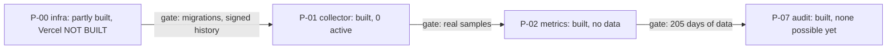

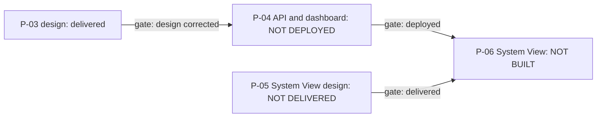

**The data path.**
- **P-00** left GitHub (signed history, rulesets, secret scanning) and
  Supabase in place. Its Vercel half is blocked: no `VERCEL_TOKEN` exists.
- **P-01**, the collector, is built and scheduled, and measures nothing until
  a verified corridor is active.
- **P-02** is built and tested on synthetic panels. The earlier P-02 brief
  assumed a running collector that did not exist yet.
- **P-07.** The intervention audit's estimator and view are built. A real
  audit needs 205 days of data on a corridor whose works have not yet begun.

**The presentation path.**
- **P-03**, the dashboard design, was delivered and then corrected: waypoints
  were removed from the Maps handoff, and alternates now come only from
  `pair_id`.
- **P-04** is built and tested against fixtures, and is not deployed.
- **P-06**, the System View, is gated on P-04 being deployed and on the P-05
  design being delivered. Neither has happened.

In later build prompts the same work carried letters:
- A: via points
- B: audit estimator
- C: small fixes
- D: the Vercel half of P-00
- E: deploy P-04
- F: build P-06

## 11. Decisions and the evidence behind them

Each entry gives what was decided, the evidence that decided it, and what was
rejected. Several reversed an earlier instruction because a simulation or a
primary source contradicted it; those entries say so. That record is the
point of this section.

**TomTom over Google.**
- Decided: TomTom, because its terms were believed to permit keeping results,
  where Google's were understood not to.
- Evidence: the original comparison is not recorded in this repository with
  a source. TomTom's public Terms and Conditions, read on 2026-09-14, prohibit
  caching or storing Results except in clients (11.4), and bar a derived
  database (11.6.1).
- Rejected: Google. **Open:** the premise of this decision is contradicted by
  the text found, and is unresolved.

**Request `routeRepresentation=summaryOnly`.**
- Decided: every sample stores the route summary and the gzipped raw response,
  never route geometry. The one geometry stored is each corridor's road,
  fetched once (below).
- Evidence: the database has a 500 MB free tier. At 2,400 calls a day the
  ledger gains about 876,000 rows a year, and the 90-day live window holds
  about 216,000. Each stored response is capped at 4 KB gzipped, which a
  response carrying route points exceeds.
- Rejected: geometry on every sample, which the collector refuses and records
  as a failure.

**Declared via points, not derived alternates.**
- Decided: every corridor declares waypoints, sent on every call. An
  alternate is a separately declared corridor.
- Evidence: without waypoints TomTom chooses the road, and can choose a
  different one between runs. Two corridors with identical endpoints would
  measure the same road twice.
- Rejected: letting TomTom pick the road, or deriving alternates at request or
  render time.

**No deck.gl or MapLibre.**
- Decided: plain `` tiles and SVG lines. A build plugin fails on any map
  library.
- Evidence: the map is a fixed frame with at most one stored road per
  corridor, which an SVG polyline draws. Nothing pans, zooms or streams
  geometry. The bundle is 75 KB gzipped. A map library would also invite
  drawing roads nobody measured.
- Rejected: deck.gl, MapLibre, Mapbox and Leaflet.

**Pooled BTI, not per cell.**
- Decided: BTI, PTI and every p95 are computed once over pooled calls, with
  floors.
- Evidence: a cell holds two to four calls. The empirical p95 of three draws
  is effectively their maximum and biased low by an amount that depends on
  the count, so cell BTIs of 0.01–0.09 were wrong. Averaging daily values
  also manufactured an effect whenever sample density changed between periods.
- Rejected: the first P-02 implementation, which computed per-cell BTI and
  averaged it.

**Harrell-Davis rejected.** This reversed an instruction: an earlier brief
asked for Harrell-Davis quantiles throughout.
- Decided: empirical percentiles, linear between order statistics.
- Evidence: at p95 the estimator's Beta weights concentrate on the top order
  statistics, so it inherits the same sparsity and overshoots in simulation.
- Rejected: Harrell-Davis.

**Block bootstrap rejected.** This reversed an instruction to replace the
call-level bootstrap with one over whole blocks.
- Decided: no block bootstrap.
- Evidence: a 28-day post period holds only two 14-day blocks, or four weeks.
  Whole-block and whole-week resampling excluded zero on 26% and 11% of
  no-effect panels even at low drift.
- Rejected: whole-block and whole-week resampling.

**All intervals removed.** This reversed an instruction to publish a
2,000-resample bootstrap interval beside every p95.
- Decided: point values with pooled counts and windows, everywhere. Migration
  0009 dropped the columns.
- Evidence:
  - ledger p95 and PTI intervals covered their true value in 68–84% of panels
    at default correlation, and 41–58% with stronger weekly drift;
  - identical corridors showed a lead in 10–20% of hours;
  - the audit interval held size at low drift (6%) and failed at 2.5 times the
    drift (20%).
- Why no gate: the bootstrap's standard error barely tracked the actual error
  (correlation −0.08 and −0.17), so publishing only when it looked safe still
  left 17% size.
- Rejected: gated intervals.

**Confidence sequence removed.**
- Decided: no sequential test. The audit reports once, after the post period
  closes.
- Evidence: the audit's always-valid confidence sequence excluded zero on
  12–18% of no-effect panels against a nominal 5% at six pre blocks. Where it
  held size, at twelve or more, it was 0.20–0.46 BTI wide. Sahil dropped it on
  that evidence.
- Rejected: reading an audit as its post period accumulates.
- Still in the pipeline: `before_after`, from the original brief, still
  computes a confidence sequence on daily TTI. Nothing serves it.

**Standardised effect rank adopted.** Sahil had asked for a stress test
before any rank rule was adopted. The test chose neither of the two candidates
then on the table.
- Decided: rank placebos by the standardised effect.
- Evidence:
  - raw |effect| read a volatile treated corridor as extreme on 11–12% of
    no-effect panels at 40 donors;
  - the post/pre RMSPE ratio held size (2–4%) but had power of only 0.10–0.64
    at 0.20 BTI, because its denominator collapses on exact fits;
  - the standardised effect held size (3–7%) with power 0.71–0.89.
- Rejected: raw |effect|, which had looked adequate on exchangeable panels,
  and the RMSPE ratio.

**Demeaned weights kept, 12 pre blocks by default.** The default had been
six pre blocks.
- Decided: demeaned simplex weights over twelve 14-day pre blocks.
- Evidence:
  - at six blocks, weights reproduced the pre series exactly in 6–43% of
    panels, and an exact fit predicts nothing;
  - levels weights (2–20%) and a five-donor cap (0%) cut exact fits, but
    detected nothing up to 0.45 BTI and left the null spread unchanged;
  - exact fits disappear at twelve blocks with demeaned weights, where the
    standardised rank reaches 0.20 BTI with 20 donors;
  - levels against demeaned showed no consistent advantage.
- Rejected: levels weights as the default, a donor cap, and six pre blocks.

**Ambiguous 429 read as quota.** Recorded 2026-09-14.
- Decided: a 429 without a Retry-After of a minute or less stops collection
  until midnight UTC.
- Evidence: TomTom's FAQ says calls return 429 when limits are exceeded. Its
  Routing documentation uses the same code for too many requests, and
  documents no header or body that tells the two apart.
- Rejected: retrying every 429, which spends calls against an exhausted
  allowance.

**Daily bucket not realigned to TomTom's day.** This reversed an instruction
to align the bucket with TomTom's daily reset.
- Decided: the bucket stays on the IST day, and the alarm counts UTC months.
- Evidence: TomTom publishes a monthly allowance and no reset time, so there
  is no documented TomTom day to align with.
- Rejected: moving the bucket to a UTC day on an assumed reset time.

**No tile proxy, no self-hosted tiles.** Recorded 2026-09-14.
- Decided: browsers load TomTom tiles directly. The traffic layer refreshes
  only in a visible tab, and a failing layer is hidden whole.
- Evidence: TomTom's Terms (11.4) allow caching only in clients, within the
  cache headers, and not to serve multiple users. Traffic tiles are documented
  as no-store.
- Rejected: pre-fetching the fixed 12-tile basemap into our own storage, and a
  caching tile proxy.

**Fetch each corridor's road once, at verification.** This reversed an earlier
decision of Sahil's, that the project holds no route geometry.
- Decided: one calculateRoute call with the polyline when a corridor is
  verified. The road is stored permanently on the corridor row, simplified for
  drawing, and refetched weekly. A refetch that differs is an alarm, never an
  update.
- Evidence: a straight connector over satellite imagery reads as a route
  claim, whatever the caption says. A corridor's road is fixed by its declared
  points, so one call is enough, and a changed road means the corridor no
  longer measures what was verified.
- Caveats:
  - TomTom documents live traffic as an input to routing, so a sample
    (`traffic=true`) can take a different road between two declared points.
    The stored road is fetched with `traffic=false`, and the daily alarm warns
    when a sample's length strays more than 2% from it.
  - Storing the road is storing a Result under TomTom's Terms 11.4, the same
    open question as the samples.
  - The rerouting thresholds (30 m, 2%) are not calibrated.
- Rejected: straight connectors whatever the basemap, and a road fetched with
  live traffic, which would differ between refetches for reasons other than a
  change of road.

**All three basemaps from TomTom.** This departed from the brief, which named
Esri World Imagery or Protomaps for satellite, and TomTom grey or CARTO
Positron for minimal.
- Decided:
  - minimal is TomTom's street tiles, desaturated in the browser;
  - street is TomTom's street tiles;
  - satellite is TomTom's `sat/main` imagery;
  - all three use the one browser key.
- Evidence, from the providers' pages read on 2026-09-14:
  - TomTom's raster styles are `main` and `night` only, and Orbis offers
    `street-light` and `street-dark`, so there is no grey style;
  - Esri's documentation requires an ArcGIS account to use its basemap
    services;
  - Protomaps serves vector tiles, which need a renderer such as MapLibre;
  - CARTO's raster basemaps need a CARTO API key and are being retired, and
    its licence file restricts the tiles to enterprise customers;
  - Google's terms allow its tiles only inside Google Maps Platform, with a
    billing-enabled key.
- Rejected: Esri, Protomaps, CARTO and Google tiles.
- Unknown: TomTom does not document whether its free tier covers satellite
  tiles.
